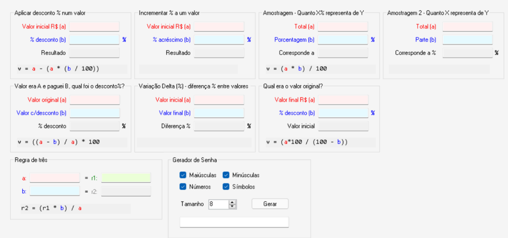

## *Trabalho de Programação orientada a objetos*

## *Sobre o projeto*

Este é um projeto em Java desenvolvido para praticar o uso do Java Swing. O objetivo era criar um programa que resolvesse diferentes tipos de cálculos matemáticos, com base em um modelo de interface fornecido em uma imagem de referência.

Decidi criar uma tela inicial onde o usuário pode escolher o tipo de cálculo que deseja realizar. Ao clicar em um dos botões, o programa direciona para a janela correspondente ao cálculo selecionado.

Ainda não é a versão final — pretendo otimizar o código e torná-lo mais legível —, mas já estou registrando aqui para acompanhar meu progresso na linguagem Java.